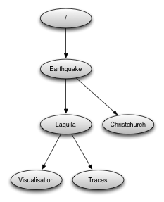
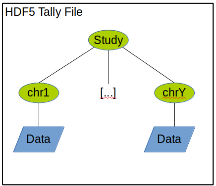

```{r setup, include=F, error=T, message=F, warning=F}
knitr::opts_chunk$set(echo=T, comment=NA, error=T, warning=F, message = F, fig.align = 'center')
```


-------

Source: http://www2.epcc.ed.ac.uk/~amrey/FDM_2015/Python/


### open a HDF5 file
```{r}
library(rhdf5)

f <- H5Fopen("example.h5")

h5ls("example.h5")

```
### open the dataset
```{r}
dataset <- H5Dopen(f, "dset")
```

### read the whole dataset
```{r}
h5read("example.h5", "dset")
```

### read a block
```{r}
h5read("example.h5", "dset", 
       start =c(2,1),             # start at row=2, col=1
       stride =c(1,3),            # only columns 1 and 3
       count =c(2,2),             # 
       block =c(1,2))
```

### creating groups
As we’ve seen above, the example we were reading has only one group, the root container “/”. Now we’re going to to create a few more groups.

After opening the file and reading its contents, this is how you create a new group named ‘Earthquake’:

```{r}
h5createGroup("example.h5", "Earthquake")
h5ls("example.h5")
```

Note that groups can be created using absolute paths or relative paths:

```{r}
h5createGroup("example.h5", "/Earthquake/Laquila")
h5ls("example.h5")
```

Now create the following group structure:



```{r}
h5createGroup("example.h5", "/Earthquake/ChristChurch")
h5createGroup("example.h5", "/Earthquake/Laquila/Visualization")
h5createGroup("example.h5", "/Earthquake/Laquila/Traces")
h5ls("example.h5")
```

### creating a new dataset
There are two ways of adding datasets:

** with `h5write**

```{r}
# writing an array
day1 = array(seq(0.1, 2.0, by=0.1), dim = c(5, 10))    # 5x2x2 array
h5write(day1, "example.h5", "/Earthquake/Laquila/Traces/day1")
h5ls("example.h5")
```

** with `h5createDataset` **

```{r}
# create new dataset
h5createDataset("example.h5", "/Earthquake/Laquila/Traces/myInts", c(5,10), 
                storage.mode = "integer", chunk=c(5,1), level=7)
h5ls("example.h5")
```

```{r}
h5ls("example.h5")
```


```{r}
#open up the dataset to add attributes to, as a class
did <- H5Dopen(f, "/dset")           # did refers to the dataset

h5writeAttribute(did, attr="Meters per second",
                 name = "Units")
```


```{r}
#look at the attributes of the aNEONsite group
h5readAttributes(file = "example.h5", 
                 name = "/dset")
```

Source: http://www.icare.univ-lille1.fr/wiki/index.php/Reading_an_HDF_file_with_C,_FORTRAN,_Python_and_IDL#R

### Read data of all datasets of a group
```{r}
filename = "example.h5"

# Read data of all datasets of a group
h5read(filename,"Earthquake")
```

### Read a dataset
```{r}
# Read a dataset
h5read(filename,"/Earthquake/Laquila/Traces/myInts")
```


```{r}
# Display the contents of main groups
h5ls(filename, FALSE)

```

```{r}
# Open a hdf5 file
fid <-H5Fopen(filename)
# Get the number of global attributes
H5Oget_num_attrs(fid)
```


```{r}
# Open the object "g2"
gid <- H5Oopen(fid, "Earthquake")
# Get group info
H5Gget_info(gid) #or H5Gget_info_by_name(fid, "g2")
# Get the number of group attributes
H5Oget_num_attrs(gid) # or H5Oget_num_attrs("g2")
```

```{r}
# Open a dataset
did <- H5Dopen(fid, "/Earthquake/Laquila/Traces/day1")
# Get dataspace
dataspace <- H5Dget_space(did)
dataspace
```


```{r}
# Close dataspace access
H5Sclose(dataspace)
#Close dataset access
H5Dclose(did)
# Close group access
H5Oclose(gid)
# Close hdf5 file access
H5Fclose(fid)
```


------------------------------------------------

## From the HDF5 User's guide

```{r}
library(rhdf5)

fid <- H5Fopen("example.h5")

h5ls("example.h5")

```

```{r}
dataset <- "/Earthquake/Laquila/Traces/day1"
datatype <- H5Dget_type(dataset)
```


```{r}
file <-  H5Fcreate("example2.h5")
status <- H5Fclose(file)
```

```{r}
RANK = 2
dimsf <- matrix(1:10, nr=5, nc=2)
dataspace <-  H5Screate(dimsf)
```

```{r}
h5ls("example2.h5")
```


-------

## 1st HDF5 example: Creating file and groups

```{r}
# Create an empty HDF5 file
library(rhdf5)
h5createFile("myhdf5file.h5")
```


The HDF5 file can contain a group hierarchy. We create a number of groups and list the file content afterwards.

```{r}
# create group foo
h5createGroup("myhdf5file.h5","foo")
```


```{r}
# create group baa
 h5createGroup("myhdf5file.h5","baa")
```


```{r}
# create sub group under foo
h5createGroup("myhdf5file.h5","foo/foobaa")
```


```{r}
# list what's in it
h5ls("myhdf5file.h5")
```


### 2nd example: writing and reading objects

```{r}
# writing a matrix
A = matrix(1:10, nr=5, nc=2)
h5write(A, "myhdf5file.h5","foo/A")

# writing an array
B = array(seq(0.1,2.0,by=0.1), dim = c(5, 2, 2))    # 5x2x2 array
attr(B, "scale") <- "liter"
h5write(B, "myhdf5file.h5","foo/B")

# writing an array of characters
C = matrix(paste(LETTERS[1:10], LETTERS[11:20],     # matrix 2x5
                 collapse=""), nr=2,nc=5)
h5write(C, "myhdf5file.h5","foo/foobaa/C")

# writing a dataframe
df = data.frame(1L:5L, 
                seq(0,1, length.out=5), 
                c("ab","cde","fghi","a","s"), stringsAsFactors=FALSE)

h5write(df, "myhdf5file.h5","df")

h5ls("myhdf5file.h5")
```


```{r}
# create new dataset
h5createDataset("myhdf5file.h5", "foo/S", c(5,8), 
                storage.mode = "integer", chunk=c(5,1), level=7)
h5ls("myhdf5file.h5")
```

```{r}
h5write(matrix(1:5, nr=5, nc=1), file="myhdf5file.h5",         # matrix 5x1
         name="foo/S", index=list(NULL,1))                     # it will write only a vector of S
h5ls("myhdf5file.h5")
```

```{r}
# we can see here that only the first column of the matrix S was written
h5read("myhdf5file.h5", "foo/S")
```

```{r}
h5write(6:10, file="myhdf5file.h5",              # write the 1st row of S, columns 2 thru 6
        name="foo/S", index = list(1,2:6))

h5read("myhdf5file.h5", "foo/S")
```

```{r}
# write data in S on rows 1 thru 5 and columns 3 thru 8
h5write(matrix(11:40, nr=5, nc=6), file="myhdf5file.h5",
        name="foo/S", index=list(1:5, 3:8))

h5read("myhdf5file.h5", "foo/S")
```

```{r}
# write a sequence in rows 3,4 and columns 1,2
h5write(matrix(141:144, nr=2, nc=2), file="myhdf5file.h5", 
        name="foo/S", index=list(3:4, 1:2))

h5read("myhdf5file.h5", "foo/S")
```

```{r}
# write sequence 2x2 in rows 2, 3and columns 3 and 6 only
h5write(matrix(151:154,nr=2,nc=2), file="myhdf5file.h5", 
        name="foo/S", index=list(2:3, c(3,6)))
h5read("myhdf5file.h5", "foo/S")
```

```{r}
# read rows 2:3 and columns 2:3
h5read("myhdf5file.h5", "foo/S", index=list(2:3, 2:3))
```

```{r}
# read specific columns
h5read("myhdf5file.h5", "foo/S", index=list(2:3,c(2,4)))
```

```{r}
# read 4 specified columns
h5read("myhdf5file.h5", "foo/S", index=list(2:3,c(1,2,4,5)))
```

###

```{r}
# create another dataset H with 5x8 
h5createDataset("myhdf5file.h5", "foo/H", c(5,8), 
                storage.mode = "integer",
                chunk=c(5,1), level=7)
h5read("myhdf5file.h5", "foo/H")
```

```{r}
h5write(matrix(1:5,nr=5,nc=1), file="myhdf5file.h5", name="foo/H", 
        start=c(1,1))
h5read("myhdf5file.h5", "foo/H")
```


```{r}
h5write(6:10, file="myhdf5file.h5", name="foo/H",
        start=c(1,2), count=c(1,5))
h5read("myhdf5file.h5", "foo/H")
```

```{r}
h5write(matrix(11:40,nr=5,nc=6), file="myhdf5file.h5", name="foo/H",
        start=c(1,3))
h5read("myhdf5file.h5", "foo/H")
```


```{r}
h5write(matrix(141:144,nr=2,nc=2), file="myhdf5file.h5", name="foo/H", 
          start=c(3,1))
 h5read("myhdf5file.h5", "foo/H")
```

```{r}
# write small matrix in two different columns
h5write(matrix(151:154,nr=2,nc=2), file="myhdf5file.h5", name="foo/H",
        start=c(2,3), stride=c(1,3))

h5read("myhdf5file.h5", "foo/H")
```

```{r}
h5read("myhdf5file.h5", "foo/H", 
       start=c(2,1),             # start at row=2, col=1
       stride=c(1,3),            # only columns 1 and 3
       count=c(2,2),             # 
       block=c(1,2))
```


```{r}
h5ls("myhdf5file.h5", all=TRUE)
```


```{r}
h5ls("myhdf5file.h5", recursive=2)
```


-----------------------------------------------------------------

## R: Introduction to HDF5 Files in R
Source: http://neondataskills.org/HDF5/Intro-To-HDF5-In-R/

```{r}
# To access HDF5 files in R, we will use the rhdf5 library which is part of the 
#Bioconductor suite of R libraries.

#install rhdf5 package
#source("http://bioconductor.org/biocLite.R")
#biocLite("rhdf5")

#Call the R HDF5 Library
library("rhdf5")
```


```{r}
# Create hdf5 file
h5createFile("vegData.h5")

## [1] TRUE

h5createFile()
## Error in h5createFile(): argument "file" is missing, with no default


```

```{r}
#create a group called aNEONSite within the H5 file
h5createGroup("vegData.h5", "aNEONSite")

## [1] TRUE

#view the structure of the h5 we've created
h5ls("vegData.h5")

##   group      name     otype dclass dim
## 0     / aNEONSite H5I_GROUP
```

```{r}
# create some sample, numeric data 
a <- rnorm(n=40, m=1, sd=1) 
someData <- matrix(a,nrow=20,ncol=2)
```


```{r}
# add some sample data to the H5 file located in the aNEONSite group
# we'll call the dataset "temperature"
h5write(someData, file = "vegData.h5", name="aNEONSite/temperature")

# let's check out the H5 structure again
h5ls("vegData.h5")

##        group        name       otype dclass    dim
## 0          /   aNEONSite   H5I_GROUP              
## 1 /aNEONSite temperature H5I_DATASET  FLOAT 20 x 2
```


```{r}
# we can look at everything too 
# but be cautious using this command!
h5dump("vegData.h5")

## $aNEONSite
## $aNEONSite$temperature
##              [,1]        [,2]
##  [1,]  0.57002015  1.65021857
##  [2,] -0.11734323  0.67155051
##  [3,]  1.09386684  1.50329628
##  [4,]  0.67163631  0.30794922
##  [5,]  0.95862965 -0.78184862
##  [6,] -0.12896460  0.59268695
##  [7,]  0.05685202  2.28120086
##  [8,]  3.26047306  0.88577061
##  [9,] -0.30819170  0.47880539
## [10,]  0.96746933  1.82340641
## [11,] -0.54678513  2.22194159
## [12,]  1.29111825  1.05592524
## [13,]  0.16009552  0.41711324
## [14,]  1.05293700  0.07952516
## [15,]  1.92990794 -0.41059841
## [16,]  1.37178810  1.29995404
## [17,]  0.43722480  1.64796389
## [18,]  2.28480893  1.72972411
## [19,]  1.33004885 -0.61370131
## [20,]  1.99261923  1.64787132

#Close the file. This is good practice.
H5close()
```

### Opening a HDF5 file to write attributes
```{r}
# Add Metadata (attributes)

# Let’s add some metadata (called attributes in HDF5 land) to our dummy temperature data. 
# First, open up the file.

#open the file, create a class
fid <- H5Fopen("vegData.h5")                           # fid is teh file id

#open up the dataset to add attributes to, as a class
did <- H5Dopen(fid, "aNEONSite/temperature")           # did refers to the dataset

# Provide the NAME and the ATTR (what the attribute says) 
# for the attribute.
h5writeAttribute(did, attr="Here is a description of the data",
                 name = "Description")
h5writeAttribute(did, attr="Meters",
                 name = "Units")

#let's add some attributes to the group
did2 <- H5Gopen(fid, "aNEONSite/")                      # did2 refers to the group
h5writeAttribute(did2, attr="San Joaquin Experimental Range",
                 name="SiteName")
h5writeAttribute(did2, attr="Southern California",
                 name="Location")

#close the files, groups and the dataset when you're done writing to them!
H5Dclose(did)
H5Gclose(did2)
H5Fclose(fid)
```


### REading a HDF5 File in R
Now that we’ve created our H5 file, let’s use it! First, let’s have a look at the attributes of the dataset and group in the file.

```{r}
#look at the attributes of the precip_data dataset
h5readAttributes(file = "vegData.h5", 
                 name = "aNEONSite/temperature")

## $Description
## [1] "Here is a description of the data"
## 
## $Units
## [1] "Meters"

#look at the attributes of the aNEONsite group
h5readAttributes(file = "vegData.h5", 
                 name = "aNEONSite")

## $Location
## [1] "Southern California"
## 
## $SiteName
## [1] "San Joaquin Experimental Range"

# let's grab some data from the H5 file
testSubset <- h5read(file = "vegData.h5", 
                 name = "aNEONSite/temperature")

testSubset2 <- h5read(file = "vegData.h5", 
                 name = "aNEONSite/temperature",
                 index=list(NULL,1))
H5close() 
# Once we've extracted data from our H5 file, we can work with it in R. 


#create a quick plot of the data
hist(testSubset2)
```


### Challenge –

Time to test your skills. Open up the D17_2013_SJER_vegStr.csv in R.

* Create a new HDF5 file called vegStructure.
* Add a group in your HDF5 file called SJER.
* Add the veg structure data to that folder.
* Add some attributes the SJER group and to the data.
* Now, repeat the above with the D17_2013_SOAP_vegStr csv.
* Name your second group SOAP

Some code is below to remind you how to import a CSV into R.


```{r}
veg <- read.csv("D17_2013_SOAP_vegStr.csv")
```


```{r}
# Create hdf5 file
h5createFile("vegStructure.h5")

#create a group called aNEONSite within the H5 file
h5createGroup("vegStructure.h5", "SJER")

# add some sample data to the H5 file located in the SJER  group
h5write(veg, file = "vegStructure.h5", name="SJER/veg")

# let's check out the H5 structure again
h5ls("vegStructure.h5")

```

```{r}
# h5dump("vegStructure.h5")
```

```{r}
H5close() 
```


---------------

## h5vc – Scalabale nucleotide tallies using HDF5
Source: http://www.bioconductor.org/packages/devel/bioc//vignettes/h5vc/inst/doc/h5vc.tour.html

In this document we will illustrate the use of the h5vc package for creating and analysing nucleotide tallies of next generation sequencing experiments.

`h5vc` is a tool that is designed to provide researchers with a more intuitive and effective way of interacting with data from large cohorts of samples that have been sequenced with next generation sequencing technologies.

This file format will store nucleotide tallies rather than alignments and allow for easy and efficient real-time random access to the data of a whole cohort of samples. The details are described in the following section.

### Nucleotide Tally Definition

The tally data structure proposed here consists of 5 datasets that are stored for each chromosome (or contig). Those datasets are:

* Counts: A table that contains the number of observed mismatches at any combination of base, sample, strand and genomic position,
* Coverages: A table that contains the number of reads overlapping at any combination of sample, strand and genomic position
* Deletions: A Table that contains the number of observed deletions of bases at any combination of sample, strand and genomic position
* Insertions: A Table that contains the number of observed insertions of bases at any combination of sample, strand and genomic position (showing insertions following the position)
* Reference: A Table that contains the reference base against which the calls in the 'Deletions' and 'Counts' table were made.

We outline the basic layout of this set of tables here:

    Name	Dimensions	Datatype
    Counts	[ #bases, #samples, #strands, #positions ]	int
    Coverages	[ #samples, #strands, #positions ]	int
    Deletions	[ #samples, #strands, #positions ]	int
    Insertions	[ #samples, #strands, #positions ]	int
    Reference	[ #positions ]	int
    
An HDF5 file has an internal structure that is similar to a file system, where groups are the directories and datasets are the files. The layout of the tally file is as follows:



A tally file can contain data from more than one study but each study will reside in a separte tree with a group named with the study-ID at its root and sub-groups for all the chromosomes / contigs that are present in the study. Attached to each of the chromosome groups are the 4 datasets described above.

Additionally each chromsome group stores sample data about the samples involved in the experiment (patientID, type, location in the sample dimension) as HDF5 attributes. Convenience functions for extracting the metadata are provided, see examples below.

### A practical example


The first thing we do is set up the session by loading the h5vc and rhdf5 packages and finding the location of the example tally file.
```{r}
library(h5vc)
library(rhdf5)

tallyFile <- system.file( "extdata", "example.tally.hfs5", package = "h5vcData" )
```


We can inspect the data contained in this file with the h5ls function provided by rhdf5.

```{r}
h5ls(tallyFile)
```

In the resulting output we can find the different groups and datasets present in the file and we can extract the relevant sample data attached to those groups in the following way.

```{r}
sampleData <- getSampleData( tallyFile, "/ExampleStudy/16" )
sampleData
```

The sampleData object is a data.frame that contains information about the samples whose nucleotide tallies are present in the file. We can modify this object (e.g. add new columns) and write it back to the file using the setSampleData function, but we must be aware that a certain set of columns have to be present (Sample, Patient, Column and Type).


```{r}
# add a column to /ExampleStudy/16
sampleData$ClinicalVariable <- rnorm(nrow(sampleData))
setSampleData( tallyFile, "/ExampleStudy/16", sampleData )
sampleData
```

Now that we can find the sample metadata in the file it is time to extract some of the nuclotide tally data stored there. We can use two functions to achieve this, `h5readBlock` can be used to read a specified block of data along a given dimension (e.g. a region along the genomic position) and `h5dapply` can be used to apply a function in a blockwise fashion along a specified dimension (e.g. calculating coverage in bins of a certain size along the genomic position dimension).

We can read out a block of data in the following way:

```{r}
data <- h5readBlock(
  filename = tallyFile,
  group = "/ExampleStudy/16",
  names = c( "Coverages", "Counts" ),
  range = c(29000000, 29001000)
  )
str(data)
```

